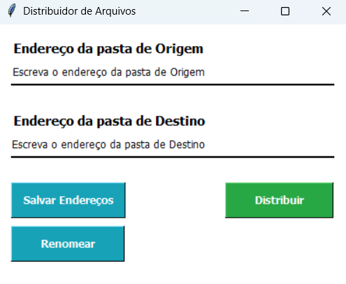

# **FILE-DISTRIBUTOR**



## Índice
1. [Introdução](#1-introdução)
2. [Instalação para desenvolvimento](#2-instalação-para-desenvolvimento)
   - [Pré-requisitos](#21-pré-requisitos)
   - [Passo 1: Clonar o repositório](#22-passo-1-clonar-o-repositório)
   - [Passo 2: Criar um ambiente virtual](#23-passo-2-criar-um-ambiente-virtual-venv)
   - [Passo 3: Ativar o ambiente virtual](#24-passo-3-ativar-o-ambiente-virtual)
   - [Passo 4: Instalar as dependências](#25-passo-4-instalar-as-dependências)
   - [Passo 5: Executar o programa](#26-executar-o-programa)
   - [Passo 6: Desativar o ambiente virtual (opcional)](#27-passo-6-desativar-o-ambiente-virtual-opcional)
3. [Como funciona](#3-como-funciona)
   - [Nomeclatura dos arquivos](#31-nomeclatura-dos-arquivos)
   - [Funcionalidades](#32-funcionalidades)
4. [Download do executável](#4-download-do-executável)
5. [Tecnologias](#5-tecnologias)

## **1. Introdução**

O File Distributor foi desenvolvido para simplificar e otimizar o processo de digitalização e arquivamento dos documentos dos colaboradores. Com ele, a movimentação manual de arquivos se torna desnecessária, garantindo mais praticidade e organização.

Em resumo, ele renomeia e distribui automaticamente os arquivos para as pastas de seus respectivos funcionários.

## **2. Instalação para desenvolvimento**

Siga os passos abaixo para configurar e executar o projeto em sua máquina.

### **2.1. Pré-requisitos**

Antes de começar, verifique se você tem o Python e o pip instalados em sua máquina.

### **2.2. Passo 1: Clonar o repositório**

Primeiro, clone o repositório do projeto para o seu ambiente local:

```bash
git clone https://github.com/luanvelloza/file-distributor.git
cd file-distributor
```

### **2.3. Passo 2: Criar um ambiente virtual (venv)**

Primeiro, clone o repositório do projeto para o seu ambiente local:

```bash
python -m venv venv
```

### **2.4. Passo 3: Ativar o ambiente virtual**

Ative o ambiente virtual que você acabou de criar:

#### **No Linux ou macOS:**
```bash
source venv/bin/activate
```

#### **No Windows:**
```bash
venv\Scripts\activate
```
### **2.5. Passo 4: Instalar as dependências**

Com o ambiente virtual ativado, instale as bibliotecas necessárias listadas no arquivo ```requirements.txt```:

```bash
pip install -r requirements.txt`
```

### **2.6. Executar o programa**

Após a instalação das dependências, você pode executar o programa com o seguinte comando: 

```bash
python app.py
```

### **2.7. Passo 6: Desativar o ambiente virtual (opcional)**

Quando terminar de usar o programa, você pode desativar o ambiente virtual com o comando:
```bash
deactivate
```

## **3. Como funciona**

O File Distributor automatiza o envio de documentos dos colaboradores, garantindo que cada arquivo, seja direcionado corretamente para a pasta do respectivo funcionário.

Antes de iniciar a distribuição dos arquivos, é essencial que todos os PDFs estejam armazenados em uma única pasta e nomeados conforme o padrão apresentado a seguir (3.1. Nomeclatura dos arquivos).

O File Distributor recebe dois URLs:
- **Origem:** Pasta que contém todos os PDFs a serem distribuídos.
- **Destino:** Pasta que contém as subpastas de cada funcionário.

Com os arquivos devidamente nomeados e os URLs de origem e destino configurados, um único clique é suficiente para distribuir os documentos diretamente para as pastas dos colaboradores ou suas subpastas.

Se a pasta de destino não for encontrada, o arquivo não será movido nem renomeado.

### **3.1. Nomeclatura dos arquivos**

Para que o aplicativo funcione corretamente, os PDFs devem ser nomeados seguindo um padrão específico:

**Exemplo:**
> NOME-DO-COLABORADOR; SUBPASTA; NOVO-NOME-DO-ARQUIVO

O uso do ponto e vírgula (";") divide o nome do arquivo em três partes:
 - **NOME-DO-COLABORADOR:** Nome da pasta onde o arquivo será armazenado.
 - **SUBPASTA:** Nome da subpasta dentro da pasta principal do colaborador.
 - **NOVO-NOME-DO-ARQUIVO:** O nome final do arquivo após a distribuição.

Além disso, é importante seguir algumas regras essenciais:

**1.** Se houver apenas duas divisões, o primeiro elemento será considerado NOME-DO-COLABORADOR, e o segundo NOVO-NOME-DO-ARQUIVO. Neste caso, o arquivo será movido para a pasta raiz do colaborador, sem subpastas.

**2.** Se a subpasta especificada não existir, o arquivo será armazenado diretamente na pasta raiz do colaborador.

**3.** O ponto e vírgula **(";")** deve ser utilizado exclusivamente para separar os elementos do nome do arquivo, não podendo ser empregado para outros fins.

### **3.2. Funcionalidades**

O aplicativo possui três funcionalidades:
- **Salvar Endereços:** Armazena os URLs em um arquivo JSON na pasta raiz do programa.
- **Renomear:** Ajusta os nomes dos PDFs na pasta de origem, deixando apenas o NOVO-NOME-DO-ARQUIVO conforme o padrão definido na seção 3.1. Nomeclatura dos arquivos. 
- **Distribuir:** Move os arquivos para seus destinos seguindo as regras previamente mencionadas.

## **4. Download do executável**

O executável permite o uso do aplicativo de forma simples e prática, tornando-o acessível para o dia a dia. Para instalá-lo, basta baixar o arquivo `FILE-DISTRIBUTOR-APP.exe` na pasta raiz do diretório.

> Nota: Em computadores com Windows, é necessário acessar as propriedades do arquivo, localizar a seção de segurança e clicar em "Desbloquear" para permitir sua execução.

## **5. Tecnologias**
- **Python:** Linguagem de programação principal.
- **FuzzyWuzzy:** Biblioteca para comparação de strings.
- **Tkinter:** Biblioteca padrão do Python para criação de interfaces gráficas (GUI).